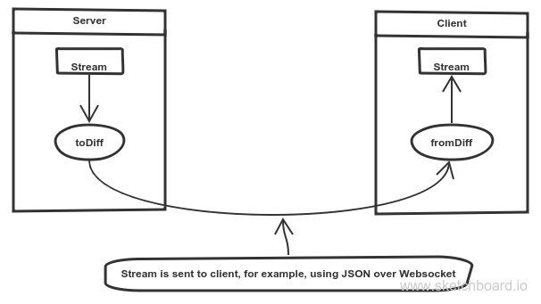

# rxjs-diff-operator
[](https://www.npmjs.com/package/rxjs-diff-operator)
[](https://travis-ci.org/DxCx/rxjs-diff-operator)
[](https://coveralls.io/github/DxCx/rxjs-diff-operator?branch=master)
[](https://github.com/conventional-changelog/standard-version)

this package adds toDiff/fromDiff operators for [RxJs 5](https://github.com/ReactiveX/rxjs).

those operators are meant for sending observables over network:


#Operators:
##toDiff
----
####signature: `toDiff(): Observable<IObservableDiff>`
### Description

toDiff operator is used to convert output of an obsersvable stream,
into a stream that contains diff information.
this operator is inteded to be used on the server.

##### Example

```typescript
//emit (1,2,3,4,5)
const source = Rx.Observable.from([1,2,3,4,5]);
//add 10 to each value
const example = source.toDiff();
//output: { type: "init", payload: 1, isObject: false }, { type: "update", payload: 2 }, ...
const subscribe = example.subscribe(val => console.log(val));
```

##fromDiff
----
####signature: `fromDiff(): Observable<any>`
### Description

fromDiff operator is used to convert output of an diff obsersvable stream (see toDiff above),
into a stream that contains diff information.
this operator is inteded to be used on the client.

##### Example

```typescript
//emit diff information
const source = Rx.Observable.from({ type: "init", payload: 1, isObject: false }, { type: "update", payload: 2 }, { type: "complete" });
//add 10 to each value
const example = source.toDiff();
//output: 1, 2
const subscribe = example.subscribe(val => console.log(val));
```

#Handling Objects:
diffing simple values is not efficient, the real power of this operator comes when
dealing with array or objects.
for that, [deep-diff](https://www.npmjs.com/package/deep-diff) is being used.

#Protocol
the protocol contains 4 message types:
  - init
    - must be the first message on the line.
    - contains isObject property which represents the payload type on the stream.
    - contains intial payload (not a diff)
  - update
    - sent for each next on the original observable
    - contains payload property as raw value (simple values) or diff object (objects/arrays)
  - error
    - sent for errors on the original observable
    - contains payload of error message
  - complete
    - sent when original observable is complete.
